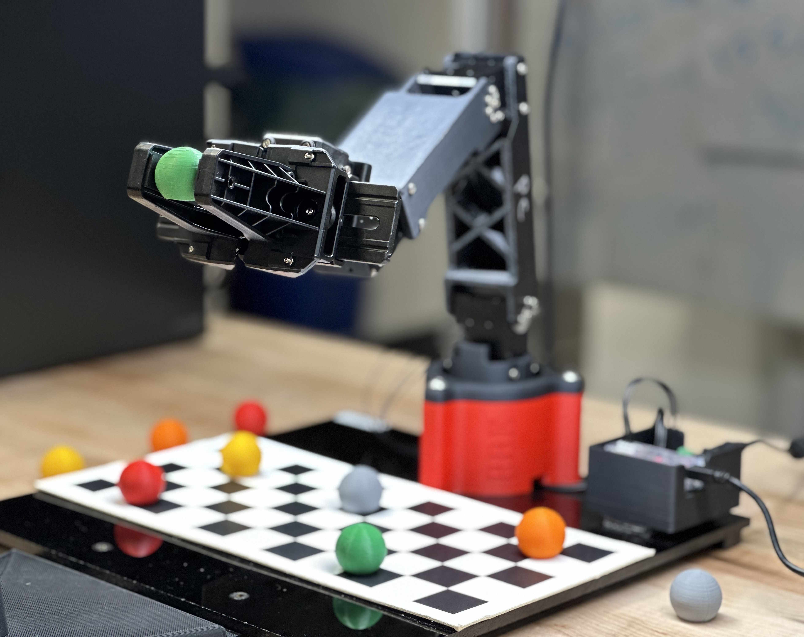

# RBE 3001

This project was created by Kai Nakamura, Owen Sullivan, and Evan Carmody. For more details and a video of the robot in action, visit [here](https://kainakamura.com/project/rbe3001).

We made a pick-and-place robot using a robotic arm and a camera. Colored 3D-printed balls are randomly placed for the robot to detect and sort. This project required us to explore and implement forward kinematics, inverse kinematics, trajectory generation, and a robust computer vision system.
